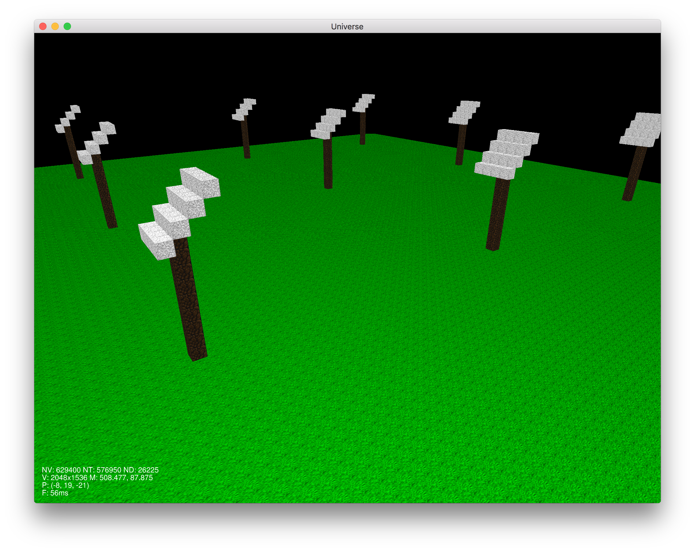

# universe



Learning C++ and OpenGL by experimenting with simple procedural generation.

## Getting Started

### Prerequisites

* C/C++ compiler
* Make
* CMake
* [Conan](https://conan.io/) package manager

### Dependencies

Some dependencies are vendored as Git submodules under `vendor/`, if you clone the repository recursively these will be cloned as well.
```
git clone --recursive https://github.com/jameshiew/universe.git
```

Others are recorded in `conanfile.txt` and can be pulled in using Conan. The Bincrafters' public Conan repository needs to be added as a Conan remote.
```
conan remote add public-conan https://api.bintray.com/conan/bincrafters/public-conan
```

### Building and running

```
mkdir build/
cd build/
conan install .. --build missing
cmake ..
make
cd bin/
./universe
```

## Controls

WASD to move about, mouse to look around, space/lctrl to go up/down.

Hold shift to go faster.

Q for wireframe mode.
